# Pr-ctica-Tema-4---Instal-laci-i-Configuraci-de-Moodle

## 1 Configuracion inicial del moodle

### 1.1. Administración del perfil del usuario
Lo primero que he hecho es entrar al moodle y poner una foto de perfil y cambiar el correo electrónico
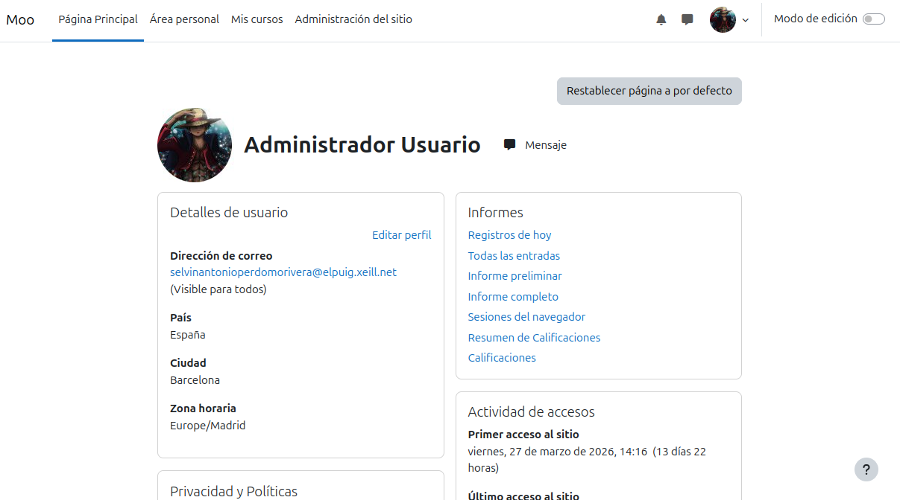

### 1.2. Configuración del lugar

### 1.2.1. Cambio de nombre
El nombre que le he puesto es Moodle la Bastida
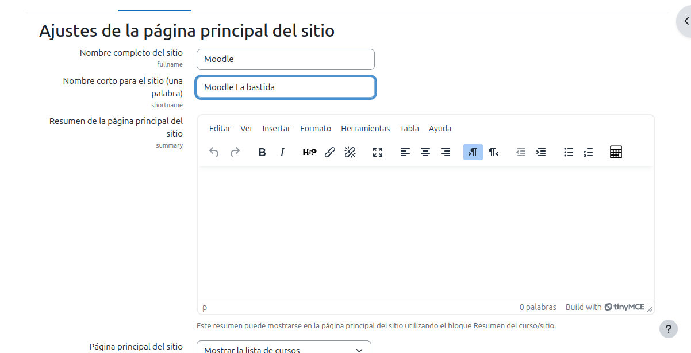

### 1.2.2. cofiguracion de la franja horaria correcta
En la franja horaria he puesto Europa/Madrid y en el pais he puesto España 
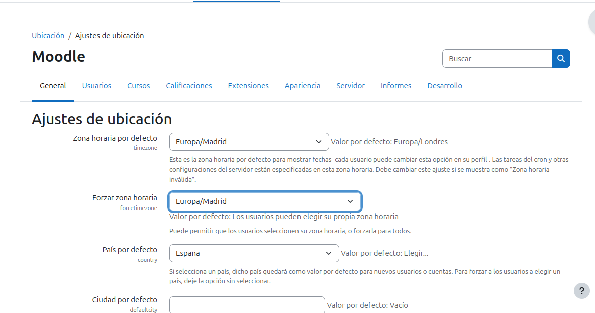

### 1.2.3. Cambio de Idioma
Instala los idimas que mas se hablan en el mundo que es el **Ingles**,**Chino**,**holandes**
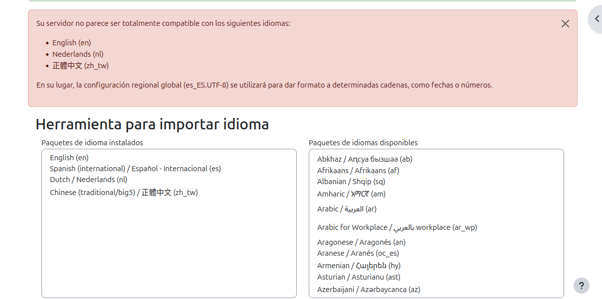

### 1.2.4. Establecer contraseñas robustas
Le he cambiado el tipo de logitud de 8 a 9 y que tenga mas cosas como 
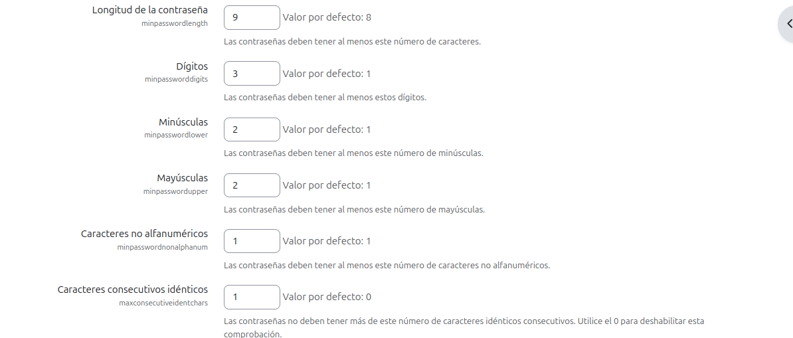

## 2. Creacion de los cursos
al primer curso que cree le llame curso A como dise el enunciado
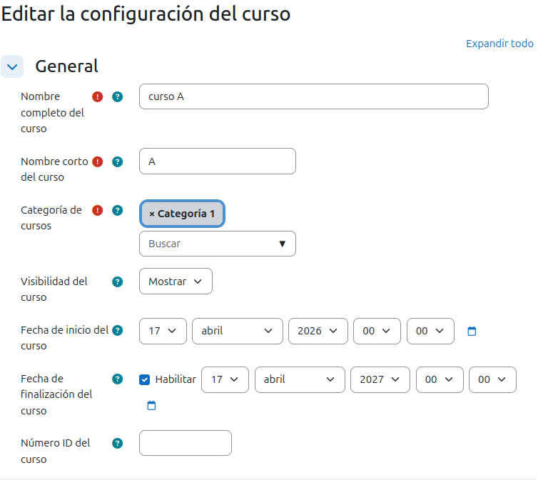

## 2.1. Temas 
En el curso A he puesto 3 temas que le he llamado **Tema 1**, **Tema 2**, **Tema 3** 
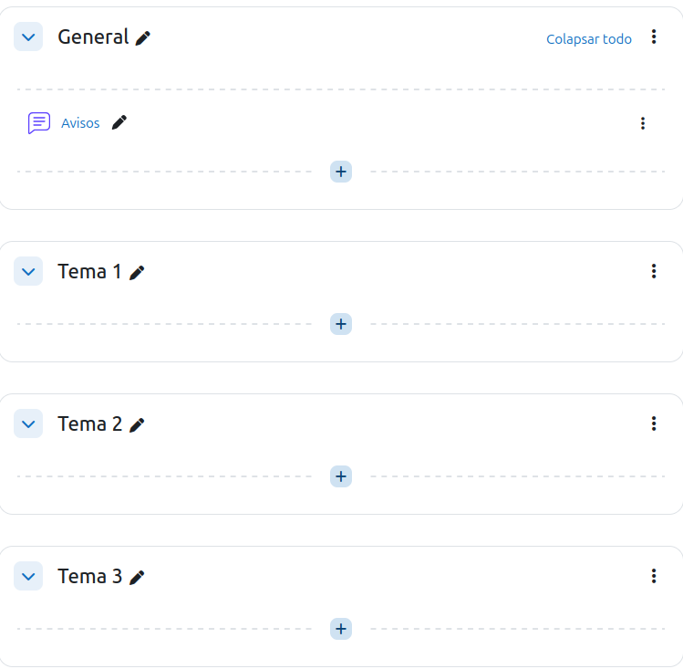

## 2.2 Curso B
He hecho lo mismo que el curso A pero en el curso B he puesto 5 temas 
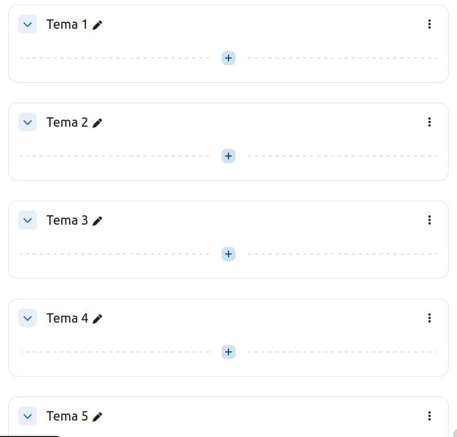

## 2.3. Creacion i gestion de usuarios 

### 2.3.1. Creacion manual de usuarios 
he creado un usuario lamado Bob y lleva mis apellidos y lehe puesto mi correo 
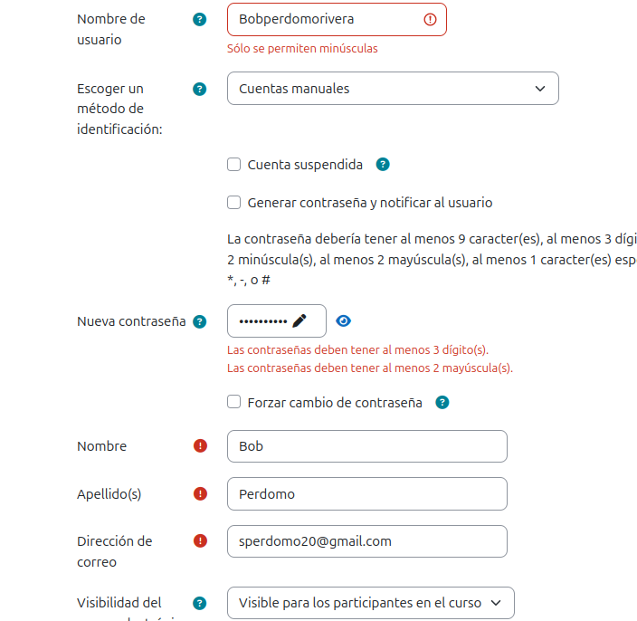

### 2.3.2. Creacion masiva de alumnos 
he creado 10 alumnos masivo con el archivo CSV 
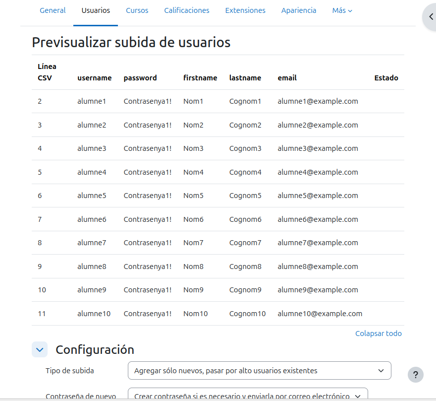

### 2.3.3. eliminacion de 2 alumnos 
Cundo me pide que elimine dos usuario yo he eliminado el **alumno1** y **alumno10**
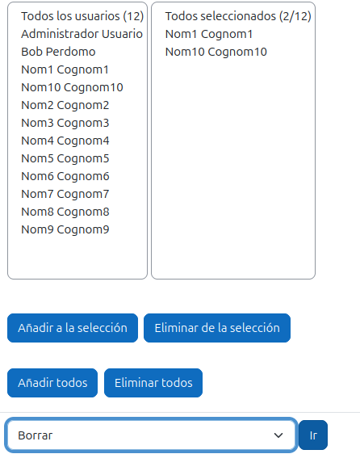

## 3. Matriculacion de los usuarios en el curso 

### 3.1. Curso A
Lo que hecho es entrar al curso darle click a participantes metodos de matriculacion y darle visualizacion a auto-matriculacion
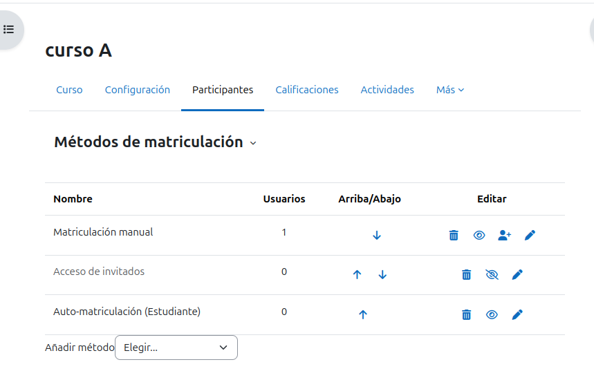

### 3.2. Curso B
asigne a Bob como profesor 
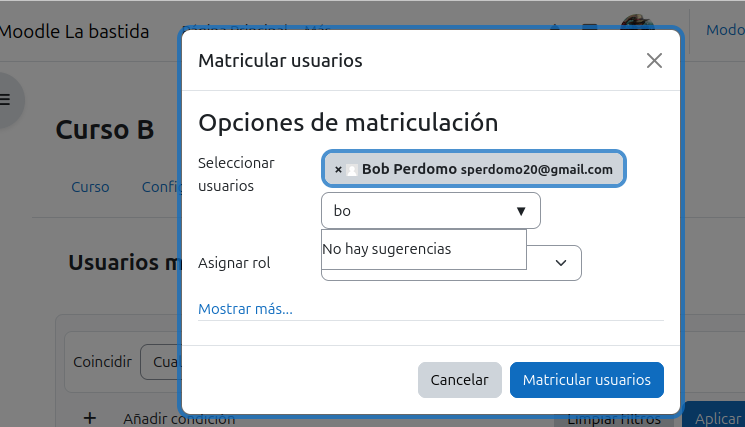

El resto de usuarios los matricule como alumnos 
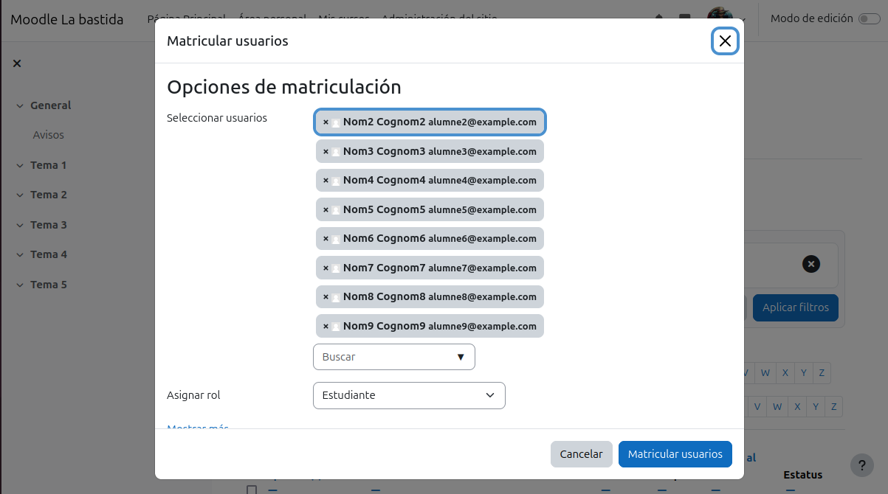

### 3.3. Comprovacion
Cuando entro al curso A me pide iniciar sesion pero cuando le doy como invitado puedo acceder.

Mientras que en el curso B no me deja acceder al curso

## 4. Personalizacion del lugar
Para el instalador de complemetos he eleigdo este plugin

### Plugin instalado

## Logotipo

## 5. Creacion de contenido y actividades 
En el curso A he puesto una tarea que no tiene data de entrega y se entrega en pdf

### 5.1. Clonacion de el curso 
en clonacion de curso he clonado lo del curso A

## 6. Calificaciones y insignias.
Encalificacion el moodle lo

